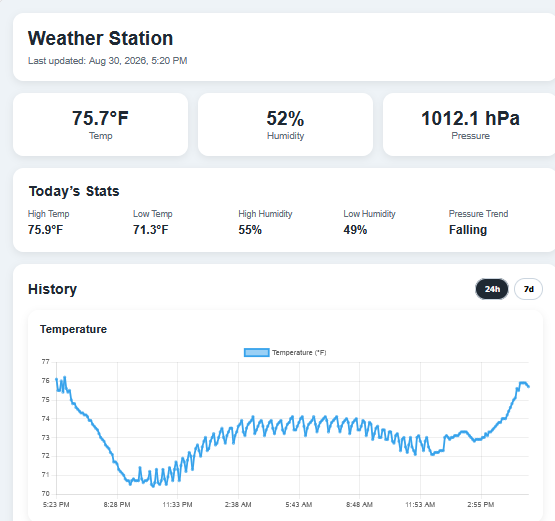
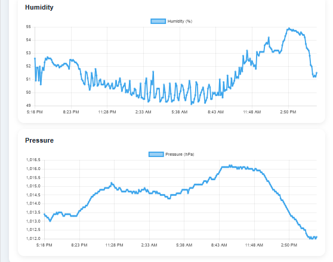
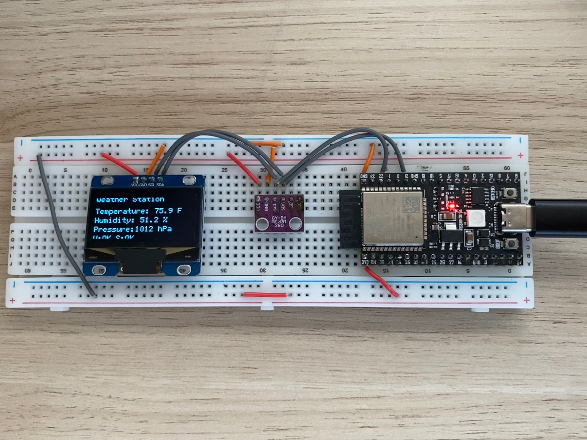

# Weather Station

A Wi-Fi connected weather station that measures local environmental conditions and displays current and historical data through a web dashboard.

The project started as a fun summer project with my son. We completed most of the system together before summer ended and school activities took over, and I later added some finishing touches to improve its robustness and prepare it for long-term use.

An ESP32 collects temperature, humidity, and atmospheric pressure readings from a BME280 sensor and periodically sends them to a Python Flask server. The server stores readings in SQLite and provides a REST API used by a browser-based dashboard.

**Live Dashboard:** https://weatherstation-production-ada2.up.railway.app

## Dashboard

The web dashboard displays current conditions along with historical temperature, humidity, and pressure data.





## Features

- Measures temperature, humidity, and atmospheric pressure
- Displays current readings on an OLED display
- Sends readings to the server over Wi-Fi
- Stores historical readings in SQLite
- Provides current and historical data through a REST API
- Displays interactive historical charts using Chart.js
- Supports 24-hour and 7-day history views
- Calculates atmospheric pressure trends
- Stores timestamps in UTC and displays them in the weather station's configured time zone
- Protects the weather-data upload endpoint with an API key
- Supports deployment of the Flask application to a hosted server

## System Architecture

```text
BME280 Sensor
      │
      ▼
    ESP32
      │
      │ HTTPS / JSON
      ▼
 Flask Server
      │
      ├────────► SQLite Database
      │
      ▼
   REST API
      │
      ▼
 Web Dashboard
 HTML / CSS / JavaScript
      │
      ▼
   Chart.js
```

The ESP32 is responsible for collecting sensor data and sending valid readings to the server. The Flask application receives and stores the readings and exposes API endpoints for the dashboard.

## Hardware

- ESP32 development board
- BME280 temperature, humidity, and pressure sensor
- 128×64 SH1106 OLED display
- Breadboard and jumper wires
- USB power supply



### Wiring

The BME280 sensor and SH1106 OLED display share the ESP32's I²C bus.

| ESP32      | BME280 | SH1106 |
| ---------- | ------ | ------ |
| **3V3**    | VCC    | VCC    |
| **GND**    | GND    | GND    |
| **GPIO21** | SDA    | SDA    |
| **GPIO22** | SCL    | SCL    |

## Software

### ESP32

The firmware:

- Initializes the BME280 sensor and OLED display
- Reads environmental measurements at a configurable interval
- Validates sensor readings before transmission
- Connects to Wi-Fi
- Sends measurements to the server as JSON
- Displays current readings and basic status information locally

### Server

The backend is written in Python using Flask.

It:

- Receives weather readings from the ESP32
- Authenticates upload requests using an API key
- Adds UTC timestamps to incoming readings
- Stores readings in SQLite
- Calculates summary statistics and pressure trends
- Provides REST endpoints for the dashboard
- Serves the dashboard's static files

### Dashboard

The dashboard is implemented with HTML, CSS, and JavaScript and uses Chart.js for historical graphs.

It displays:

- Current temperature
- Current humidity
- Current atmospheric pressure
- Pressure trend
- Last update time
- Historical temperature, humidity, and pressure charts

Users can switch between 24-hour and 7-day history views.

## API

### `GET /api/station`

Returns information about the weather station.

Example:

```json
{
  "name": "Weather Station",
  "timeZone": "America/Chicago",
  "sampleIntervalMinutes": 5
}
```

### `POST /api/readings`

Receives a new sensor reading from the ESP32.

Example request:

```json
{
  "temperatureF": 78.4,
  "humidity": 52.1,
  "pressureHpa": 1013.2
}
```

The server assigns the timestamp when the reading is received.

The request must include the configured API key in the `X-API-Key` header.

### `GET /api/weather/latest`

Returns the most recent weather reading.

### `GET /api/weather/history`

Returns historical weather readings for the requested time range.

## Time Handling

All timestamps are stored and transmitted by the API in UTC.

The station's local time zone is configured on the server and exposed through `/api/station`. The dashboard converts UTC timestamps to the station's configured time zone when displaying dates and times.

This keeps stored data independent of server location while ensuring that users see times appropriate for the physical weather station.

## Server Configuration

Server configuration is provided through environment variables.

```text
STATION_NAME
STATION_TIMEZONE
WEATHER_API_KEY
```

For example:

```text
STATION_NAME=Backyard Weather Station
STATION_TIMEZONE=America/Chicago
```

## ESP32 Configuration

The ESP32 firmware is built using PlatformIO.

Before building the firmware, copy the provided configuration template:

```
cp Firmware/include/secrets.example.h Firmware/include/secrets.h
```

Edit `secrets.h` to configure the Wi-Fi credentials, API key, and server settings for the weather station.

The `USE_LOCAL_SERVER` setting determines which server receives weather readings:

```
#define USE_LOCAL_SERVER 0
```

Set the value to:

- `0` — send readings to the deployed Railway server
- `1` — send readings to a server running on the local network

The actual `secrets.h` file is excluded from Git to prevent credentials from being committed to the repository. `secrets.example.h` is provided as a template containing the required configuration fields.

The `certificates.h` file contains the certificate information used by the ESP32 to establish a secure connection with the deployed server.

## Project Structure

```text id="g86pbd"
weather-station/
├── ESP32/
│   ├── include/
│   │   ├── certificates.h
│   │   └── secrets.h
│   ├── src/
│   │   └── main.cpp
│   └── platformio.ini
│
├── Server/
│   ├── static/
│   │   ├── index.html
│   │   ├── styles.css
│   │   └── app.js
│   ├── app.py
│   └── database.py
│
└── README.md
```

### ESP32

The `Firmware` directory contains the PlatformIO project for the weather station firmware.

- `src/main.cpp` contains the weather station firmware.
- `include/secrets.h` contains local configuration and credentials used by the firmware.
- `include/certificates.h` contains the certificate information used for secure communication with the server.
- `platformio.ini` defines the ESP32 board configuration and library dependencies.

Files containing credentials or other secrets should not be committed to the repository.

### Server

The `Server` directory contains the Flask backend, database access code, and web dashboard.

- `app.py` implements the Flask application and REST API and serves the dashboard.
- `database.py` contains the SQLite database operations.
- `static/` contains the HTML, CSS, and JavaScript for the web dashboard.

## Running the Server

Change to the server directory:

```bash
cd Server
```

Create a Python virtual environment:

```bash
python -m venv .venv
```

Activate the virtual environment.

On Windows:

```bash
.venv\Scripts\activate
```

On macOS or Linux:

```bash
source .venv/bin/activate
```

Install the required Python dependencies:

```bash
pip install -r requirements.txt
```

Set the required environment variables and start the Flask development server:

```bash
python app.py
```

Once the server is running, open the server URL in a browser to view the weather dashboard.

## Deployment

The server and web dashboard are deployed on Railway.

Railway is configured with `/Server` as the root directory and uses Gunicorn to run the Flask application:

```bash
gunicorn app:app --bind 0.0.0.0:$PORT
```

The `$PORT` environment variable is provided by Railway.

The SQLite database is stored on a persistent Railway volume so that historical weather data is preserved across application deployments and restarts.

Production configuration, including the station name, station time zone, database location, and API credentials, is supplied through environment variables.

## Future Improvements

Possible future additions include:

- Station health monitoring and offline notifications
- Improved handling and reporting of sensor failures
- Additional weather sensors
- Weather alerts
- Data export
- Longer-term historical analysis
- AI-assisted weather summaries and trend analysis

## What This Project Demonstrates

This project combines several areas of software and hardware development:

- Embedded C++ development on the ESP32
- Sensor and OLED integration
- Wi-Fi and HTTPS communication
- JSON-based REST APIs
- Python and Flask backend development
- SQLite database design
- UTC and time-zone handling
- HTML, CSS, and JavaScript frontend development
- Interactive data visualization
- Cloud deployment
- Basic API authentication
